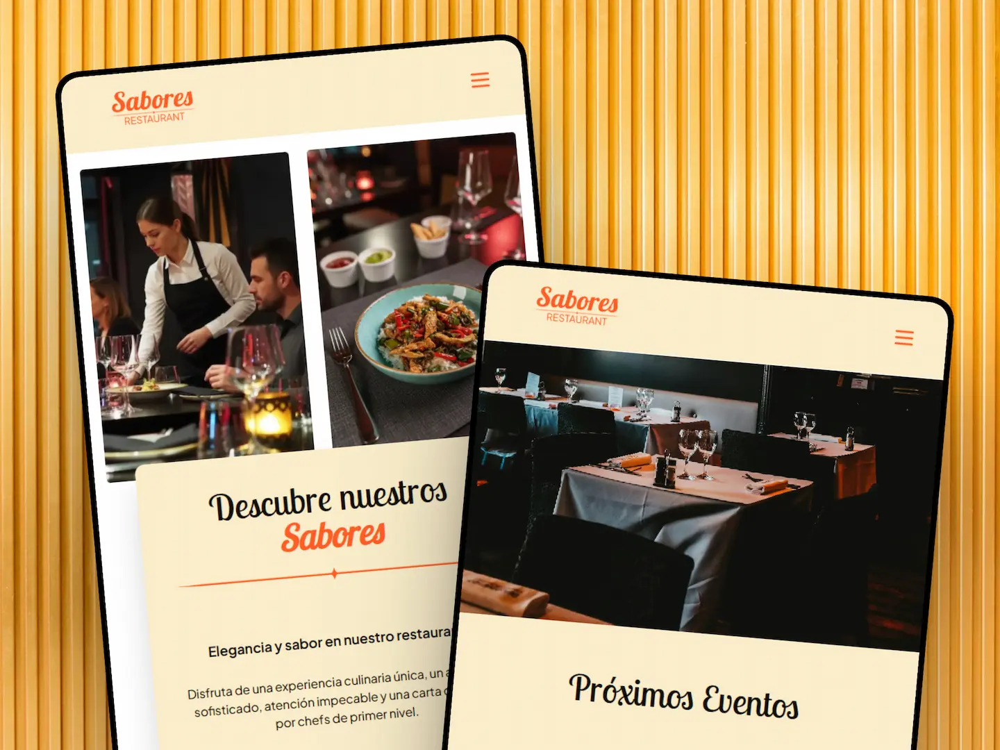
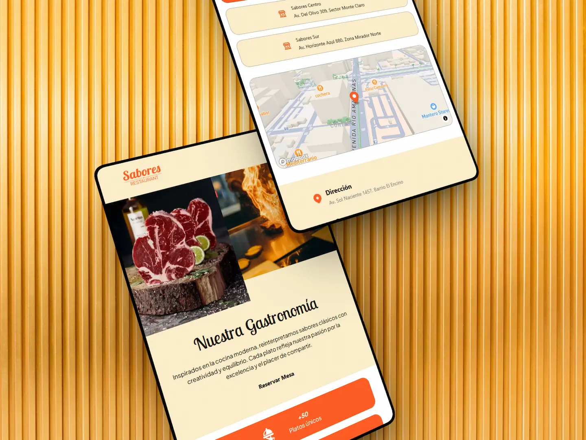
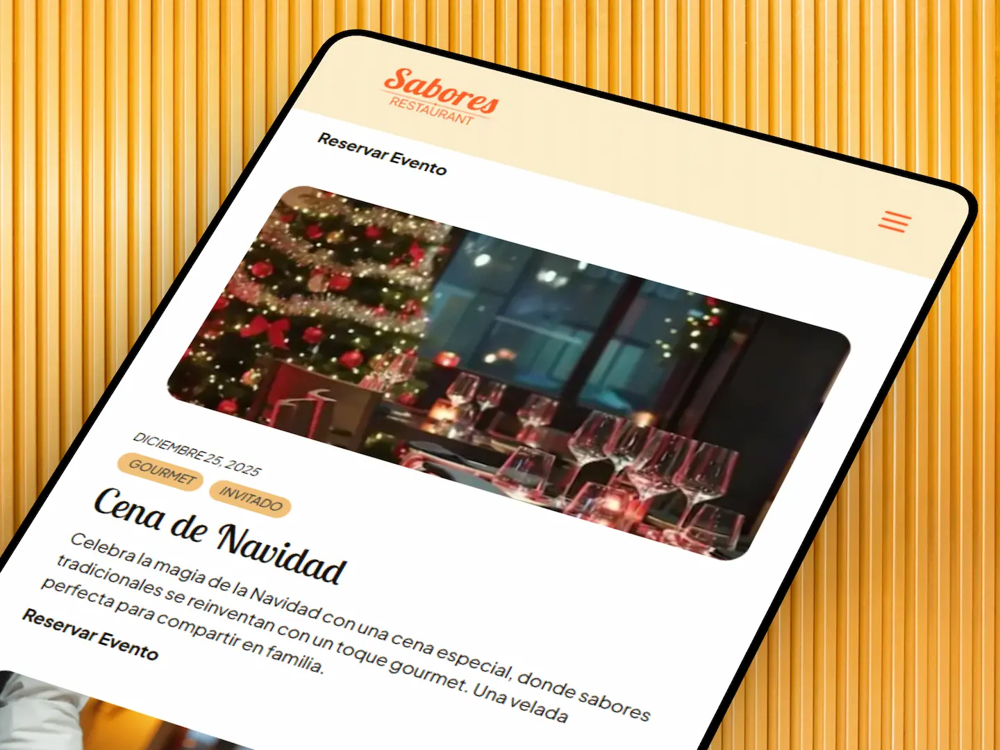
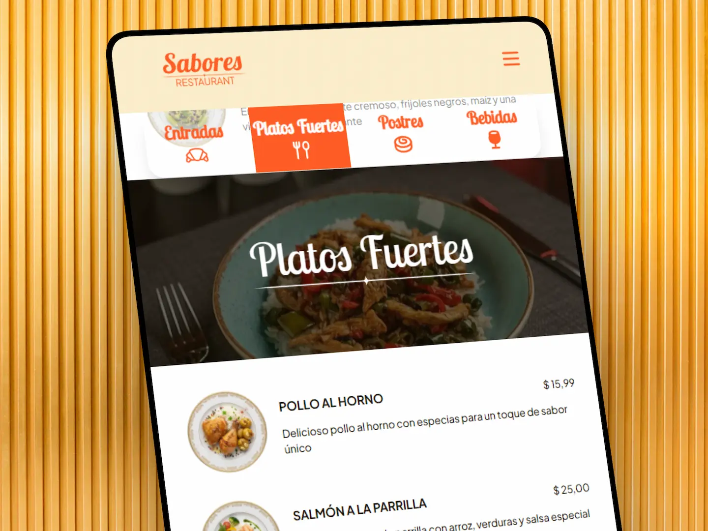
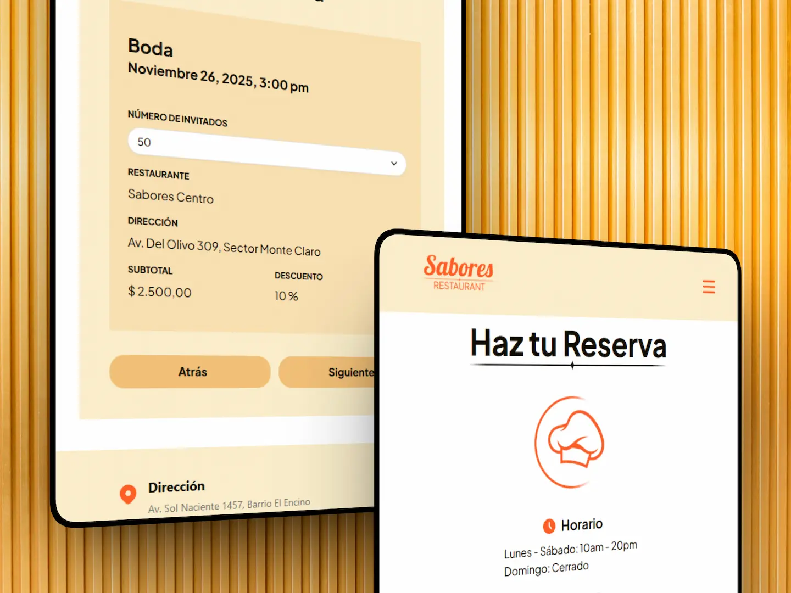
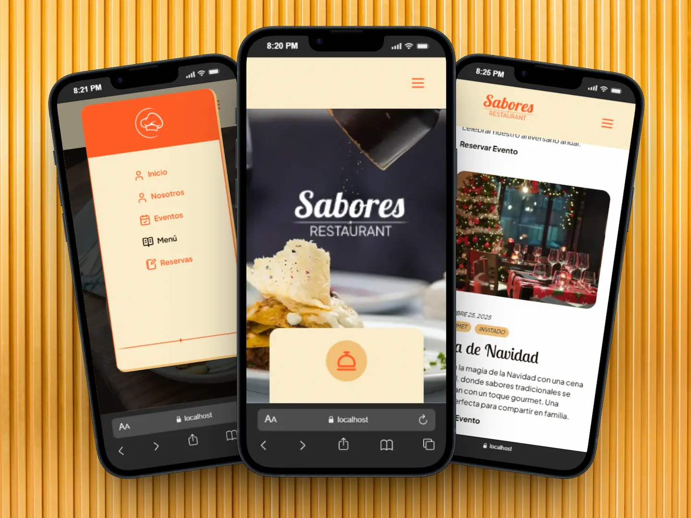

<h1 align="center">Sabores - Restaurant Gourmet</h1>

  

 

## Description

Sabores Restaruant is an elegant gourmet restaurant that offers gourmet meals and service to all our distinguished customers.

We are pleased to offer our website to all our customers, where you can explore our services, view our menu, and find out much more.

**[✨ Check the website here](https://sabores-restaurant.netlify.app/)**

## Web Content

#### 🏠 Home Page

Our home page highlights the quality of our exclusive service, gourmet meal options, upcoming events and general information about us.

  

#### 👥 About Us

Learn and discover our history. Our about page offers detailed information about the restaurant, our service philosophy, our gourmet cuisine and our talented team of chefs. Find out about our achievements, what clients says about us and our main locations.

  

#### 🏪 Restaurant Events

Dive into new and exclusive experiences with us. In our events page you can find all our upcoming events with detail and easily access the booking service for any of them.

  

#### 🍽️ Restaurant Menu

Discover our delicious menu. Our menu page highlights our most succulent appetizers, gourmet dishes, exquisite desserts and refreshing drinks.

  

#### 📋 Bookings

Access to our booking service with ease in our booking page. Choose your event, restaurant, date & time, number of guests and your prefered payment method in our intuitive booking form.

  

#### 📱 Adaptive Interface

Our web features a fully responsive design that looks and works great on any screen size. Enjoy an exclusive experience to discover our services whether you are on a desktop computer, a tablet or a mobile device.

  

## 💻 Tech Stack

- [![Angular][angular-badge]][angular-url] - A component-based framework for building scalable web applications
- [![Tailwind][tailwind-badge]][tailwind-url] - A utility-first CSS framework for rapidly building custom designs.

<!-- Repository Links -->

[angular-badge]: https://img.shields.io/badge/Angular-fff?style=for-the-badge&logo=angular&logoColor=fff&color=E82B69
[tailwind-badge]: https://img.shields.io/badge/Tailwind-fff?style=for-the-badge&logo=tailwindcss&logoColor=fff&color=00bcff

<!-- Repository Links -->

<!-- Tech Stack Links -->

[angular-url]: https://v19.angular.dev/
[tailwind-url]: https://tailwindcss.com/

<!-- Tech Stack Links -->
